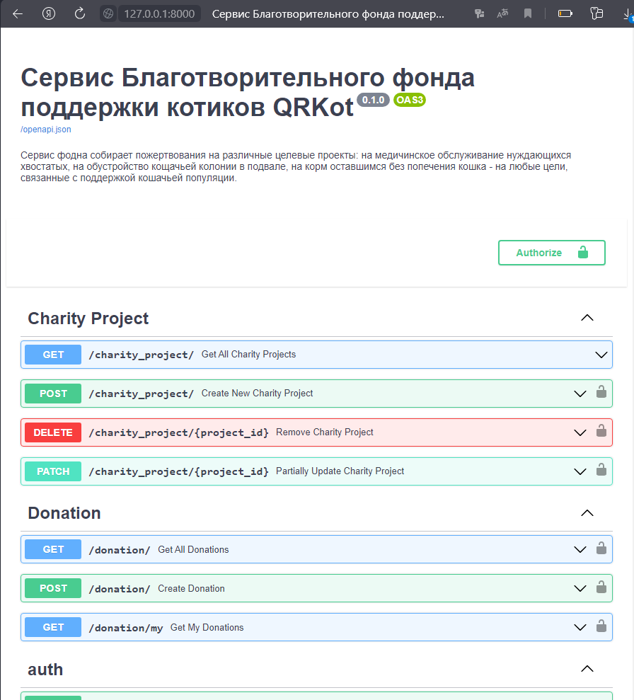
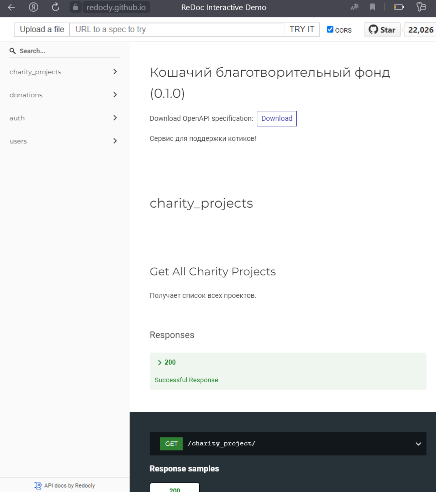
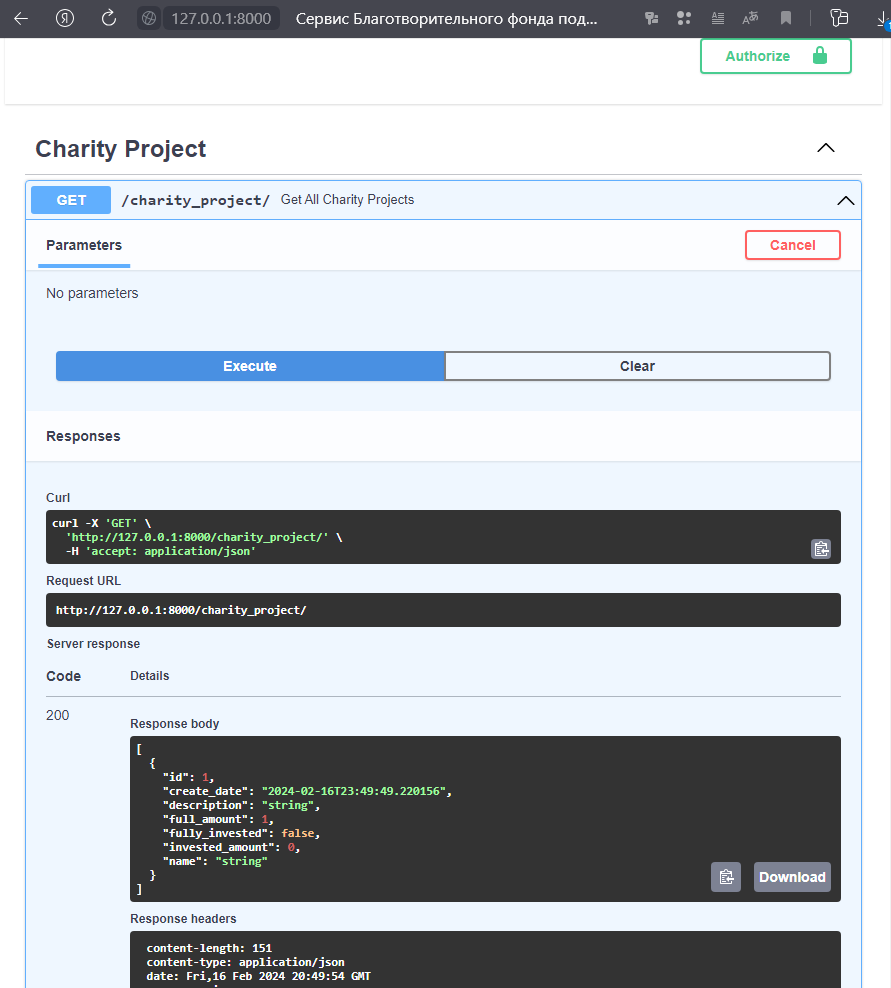

# cat_charity_fund

### Описание проекта:

Проект QRKot — приложение для Благотворительного фонда поддержки котиков. Фонд собирает пожертвования на различные целевые проекты: на медицинское обслуживание нуждающихся хвостатых, на обустройство кошачьей колонии в подвале, на корм оставшимся без попечения кошкам — на любые цели, связанные с поддержкой кошачьей популяции.


### Как запустить проект:

Клонировать репозиторий и перейти в yacut в командной строке:
```
git clone https://github.com/mixer-sys/cat_charity_fund.git
cd cat_charity_fund/
```

Установить зависимости
```
python3 -m venv venv
source venv/Scripts/activate
pip3 install -r requirements.txt
```

Cоздать файл .env, пример .env.example
```
APP_AUTHOR=Griga
AUTHOR_PASS=testik_grig@
DEADLINE_DATE=01.02.2024
APP_TITLE=Сервис Благотворительного фонда поддержки котиков QRKot 
DESCRIPTION=Сервис фодна собирает пожертвования на различные целевые проекты: на медичинское обслуживание нуждающихся хвостатых, на обустройство кощачьей колонии в подвале, на корм оставшимся без попечения кошка - на любые цели, связанные с поддержкой кошачьей популяции.
DATABASE_URL=sqlite+aiosqlite:///./fastapi.db
SECRET=INIFAPFNVFKJFADF134133
FIRST_SUPERUSER_EMAIL=testik@testik.ru
FIRST_SUPERUSER_PASSWORD=testik
```

Запустить
```
uvicorn app.main:app --reload
```
Перейти по ссылке
```
http://127.0.0.1:8000/docs
```

### Возможности проекта:

http://127.0.0.1:8000/docs



### Описание API

Содержится в файле openapi.json

Можно открыть по ссылке https://redocly.github.io/redoc/



Примеры:



